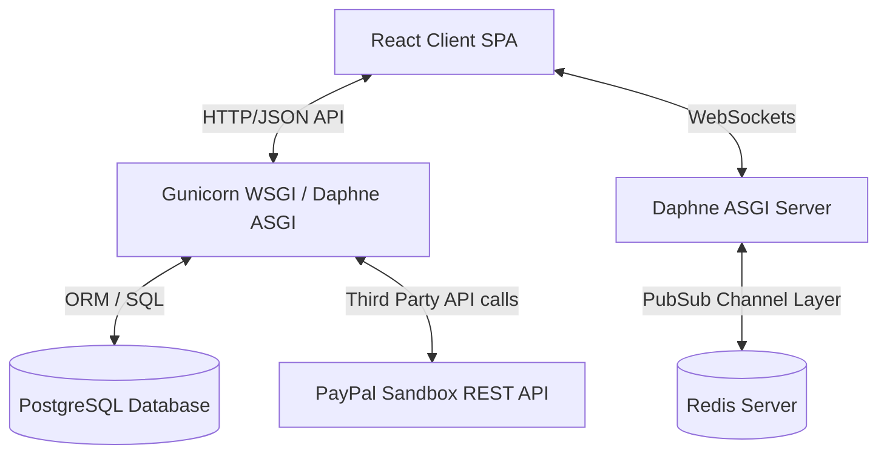
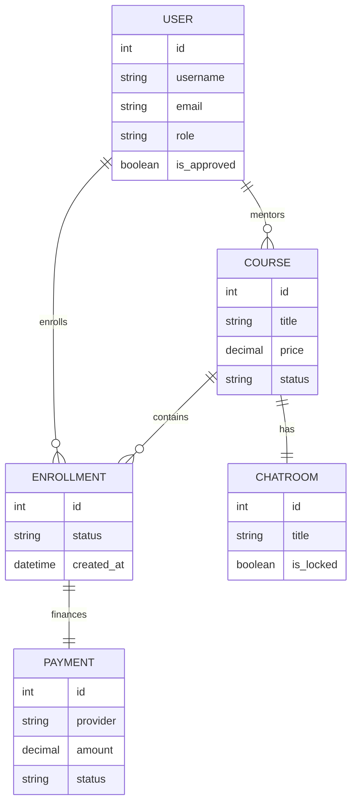
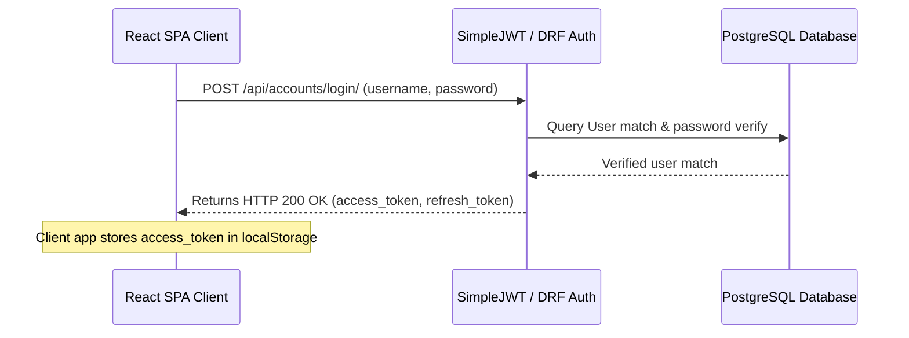
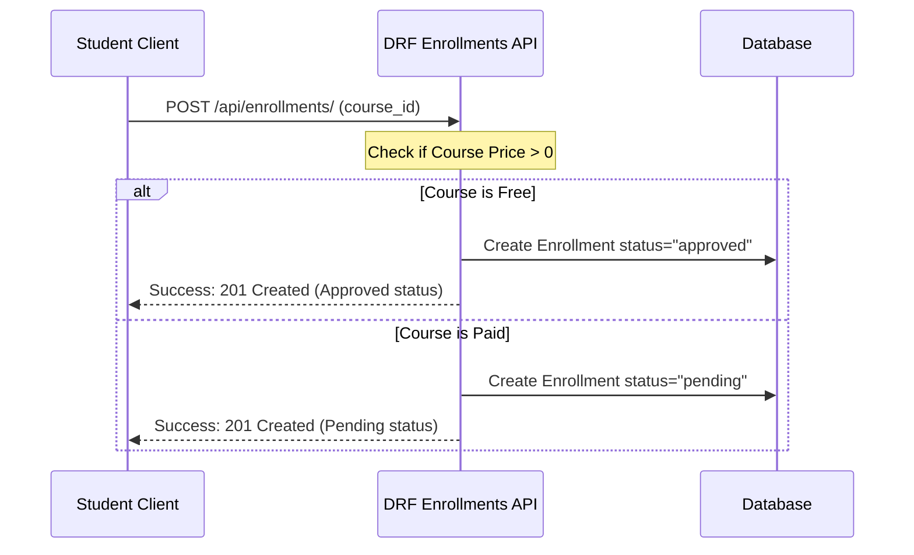
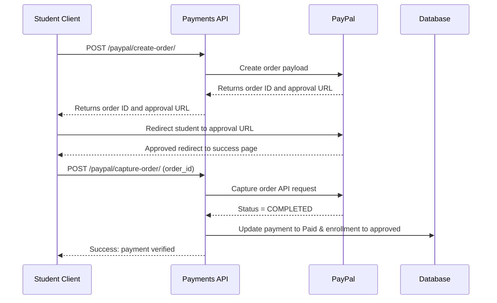
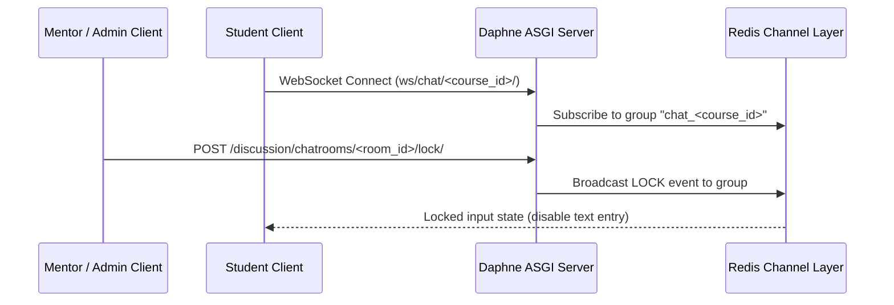

# LightLearn LMS — System Architecture & Flows

This document details systems layout, data modeling, authentication routing, and transactional flowcharts using Mermaid diagrams.

---

## 1. System Architecture Diagram

---

## 2. Database ER Diagram

---

## 3. JWT Authentication Flow

---

## 4. Course Enrollment Flow

---

## 5. Payment Flow (PayPal Integration)

---

## 6. Chat / WebSocket Flow

